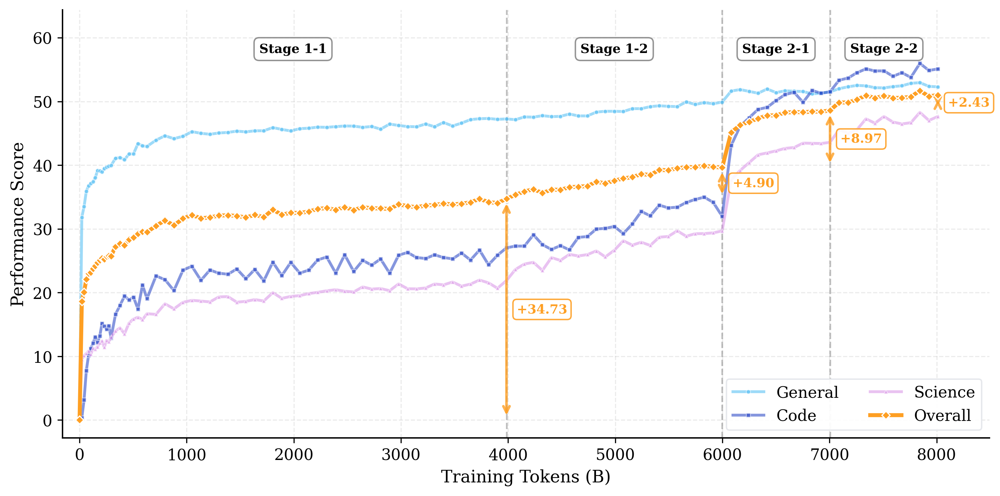

# daVinci-LLM: Towards the Science of Pretraining

<div align="center">

[](https://arxiv.org/abs/2603.27164)
[](https://huggingface.co/datasets/SII-GAIR-NLP/davinci-llm-data)
[](https://huggingface.co/SII-GAIR-NLP/davinci-llm-model)
[](LICENSE)

</div>

**daVinci-LLM** is an open pretraining research project. We train models from scratch and release everything: data, training process, ablation results, and failed experiments, so you can build on our findings, not repeat our mistakes.

**Current release**: daVinci-3B matches OLMo3-7B, demonstrating that systematic, evidence-based methodology can unlock greater capability from smaller models.

> 🚀 **Ongoing project**: We’re continuously exploring new frontiers and will release models, data, and insights as they mature.


<div align="center">
  
</div>


## 🎁 What We Release

| Resource | Description |
|----------|-------------|
| [🤖 **Model**](https://huggingface.co/SII-GAIR-NLP/davinci-llm-model) | daVinci-LLM-3B final checkpoint + all intermediate checkpoints |
| [📊 **Training Data**](https://huggingface.co/datasets/SII-GAIR-NLP/davinci-llm-data) | 7.5T+ tokens of fully traceable, high-quality pretraining corpus |
| [📄 **Technical Report**](https://arxiv.org/abs/2603.27164) | Complete exploration process: data decisions, training dynamics, systematic ablations, and failed experiments |
| 🔧 **Pretraining Pipeline** (Coming soon) | Integrated pipeline for data processing, training, and evaluation |


## 🏛️ Three Pillars of Full Openness

daVinci-LLM is structured around three pillars, each contributing to transparency and reproducibility:

### 1. 📊 Data Transparency — The Data Darwinism Framework

We adopt the **Data Darwinism framework** to systematically organize data processing from L0 (raw acquisition) to L9 (full synthesis). Our **7.5T+ token** corpus combines publicly available datasets with our own processed and **openly released** data—every source is annotated with its Darwin Level, making processing decisions transparent and enabling researchers to assess quality depth and reuse our data assets.


| Level | Operation | What It Does |
|-------|-----------|--------------|
| **L0** | Data Acquisition | Collect raw data from diverse sources |
| **L1** | Format Normalization | Convert heterogeneous formats into unified text |
| **L2** | Rule-Based Filtering | Remove duplicates, malformed text, non-target languages |
| **L3** | Model-Based Filtering | Assess educational value and domain relevance via classifiers |
| **L4** | Generative Refinement | Remove structural noise and repair content while preserving semantics |
| **L5** | Cognitive Completion | Make implicit reasoning explicit (e.g., expand compressed logical steps) |
| **L6–L9** | Higher-Order Synthesis | Contextual/environment/ecosystem synthesis (theoretical frontier) |

> 📖 **For the complete Data Darwinism framework**: See [Data Darwinism](https://arxiv.org/abs/2602.07824)


### 2. 🎓 Training Transparency — Adaptive Two-Stage Curriculum

<div align="center">
  
</div>

daVinci-LLM uses a **dynamically monitored, adaptively adjusted** two-stage curriculum:

- **Stage 1 (6T tokens)**: Builds broad foundations. Continuous evaluation reveals that general knowledge saturates early (~1T tokens) while code and science reasoning sustain growth beyond 4T—prompting progressive reallocation toward reasoning-intensive domains.

- **Stage 2 (2T tokens)**: Introduces structured QA data in a progressive curriculum. Stage 2-1 balances across domains to establish stability; Stage 2-2 intensifies QA concentration for targeted reasoning amplification—yielding a **+12.14 gain**.

### 3. 🧪 Scientific Transparency — 200+ Controlled Ablations

We transformed key pretraining decisions into systematically verifiable research questions. Through 200+ controlled experiments, we investigated:

<details>
<summary><b>📌 Does deeper data processing actually improve capabilities?</b></summary>

- L3 filtering: Modest gains on basic tasks (+3.4 on MBPP)
- L4 refinement: Substantial gains on complex reasoning (+7.0 on MATH)
- L5 synthesis: Strong domain alignment but limited transfer
- **Insight**: Processing depth is a complementary dimension to data volume scaling

</details>

<details>
<summary><b>📌 How should training adapt as capabilities mature differently?</b></summary>

- General knowledge plateaus at ~1T tokens; reasoning grows past 4T
- Domain rebalancing works initially, but hits limits
- Format shift (introducing QA) unlocks further growth
- **Insight**: No single mixture suffices—monitor and adapt

</details>

<details>
<summary><b>📌 Can we intensify reasoning without catastrophic forgetting?</b></summary>

- Extreme specialization triggers collapse
- Progressive strategy: balanced foundation (equal parts QA/code/science) → targeted intensification (70% QA)
- **Insight**: Balance first, then intensify

</details>

<details>
<summary><b>📌 Are our evaluation metrics reliable?</b></summary>

- PPL vs. generative evaluation can produce ranking reversals
- High-QA models show protocol-specific artifacts
- **Insight**: Report multiple protocols for complete capability profiles

</details>

> 💡 **Full ablation details, configurations, and negative results**: See [Section 4 of our technical report](https://arxiv.org/abs/2603.27164)


## 📊 Key Results: 3B Matches 7B


Our **daVinci-LLM-3B** achieves an overall score of **51.72**, matching OLMo-3 7B despite having less than half the parameters. Notably, it substantially outperforms on complex reasoning tasks like **MATH** (62.80 vs. OLMo-3’s 39.60), demonstrating the value of systematic, evidence-based pretraining.

| Capability Dimension | daVinci-3B | OLMo-3 7B | LLaMA-3.2-3B | Qwen-2.5-3B |
| -------------------- | ---------: | --------: | -----------: | ----------: |
| **Overall Perfomance**   |      **51.72** |     **51.65** |        37.58 |       51.44 |
| General Knowledge    |      52.96 |     55.13 |        51.08 |       55.16 |
| Code Generation      |      55.99 |     54.42 |        32.40 |       56.13 |
| Scientific Reasoning |      48.30 |     45.98 |        22.45 |       44.65 |
| MATH                 |      62.80 |     39.60 |         9.00 |       37.20 |


## 📚 Citation

If you find this work helpful, please consider citing:

```bibtex
@misc{qin2026davincillmtowardssciencepretraining,
      title={daVinci-LLM:Towards the Science of Pretraining},
      author={Yiwei Qin and Yixiu Liu and Tiantian Mi and Muhang Xie and Zhen Huang and Weiye Si and Pengrui Lu and Siyuan Feng and Xia Wu and Liming Liu and Ye Luo and Jinlong Hou and Qipeng Guo and Yu Qiao and Pengfei Liu},
      year={2026},
      eprint={2603.27164},
      archivePrefix={arXiv},
      primaryClass={cs.AI},
      url={https://arxiv.org/abs/2603.27164},
}
```

If you use the Data Darwinism framework, please also cite:
```bibtex
@misc{qin2026datadarwinismiunlocking,
      title={Data Darwinism Part I: Unlocking the Value of Scientific Data for Pre-training}, 
      author={Yiwei Qin and Zhen Huang and Tiantian Mi and Weiye Si and Chenyang Zhou and Qipeng Guo and Siyuan Feng and Pengfei Liu},
      year={2026},
      eprint={2602.07824},
      archivePrefix={arXiv},
      primaryClass={cs.AI},
      url={https://arxiv.org/abs/2602.07824}, 
}
```
